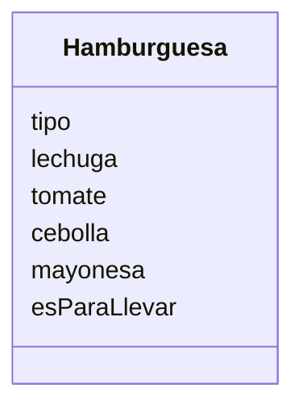

Un restaurante quiere ofrecer hamburguesas
Los clientes pueden elegir entre hamburguesa de: res, pollo
o vegetariana.
Los clientes pueden agregar extras como: lechuga, tomate, 
cebolla y mayonesa
Ademas los clientes pueden decidir comer en el restaurante 
o llevar su pedido

# Análisis

Requisitos
- Ofrece hamburguesas de res o pollo o vegetarianas
- Agregar lechuga
- Agregar tomate
- Agregar Cebolla
- Agregar Mayonesa
- Comer en el restaurante o llevar el pedido

Objetos:
- Hamburguesa

Características:
- Hamburguesa
  - tipo
  - lechuga
  - tomate
  - cebolla
  - mayonesa
  - esParaLlevar

Acciones:
- (No hay acciones)

# Diseño:
Clases:
- Hamburguesa:
  - Nombre: Hamburguesa
  - Atributos:
    - tipo
    - lechuga
    - tomate
    - cebolla
    - mayonesa
    - esParaLlevar

# Diagrama de clases:

