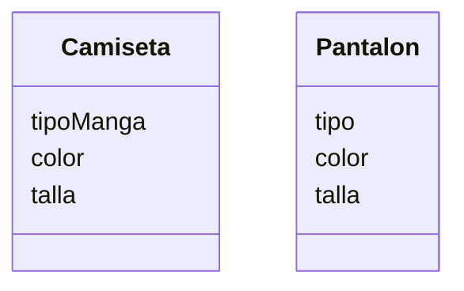

Una tienda de ropa quiere ofrecer camisetas y pantalones
Los clientes pueden elegir entre: camiseta
de manga corta o larga y pantalón de mezclilla o tela
Las camisetas pueden ser de color rojo, azul o verde
y los pantalones de color negro, gris o blanco
Las camisetas tienen las tallas: S, M, L, XL
Los pantalones tienen las tallas desde la 32 hasta la 44

# Analisis

Requisitos:
- Ofrece camiseta o pantalon
- Camiseta manga larga o corta
- Pantalon de mezclilla o tela
- Color de camiseta rojo o azul o verde
- Talla de camiseta S o M o L o XL
- Talla de pantalon entre 32 o 44
- Color de pantalon negro o gris o blanco

Objetos:
- Camiseta
- Pantalon

Caracteristica:
- Camiseta
  - tipo de manga
  - color
  - talla
- Pantalon
  - tipo
  - color
  - talla

Acciones:
- (No hay acciones)

# Diseño

Clases:
- Camiseta:
  - Nombre: Camisa
  - Atributos:
    - tipoManga
    - color
    - talla
  - Metodos:
    - (No hay metodos)

- Pantalon:
  - Atributos:
    - tipo
    - color
    - talla
  - Metodos:
    - (No hay metodos)

# Diagrama de clases:

