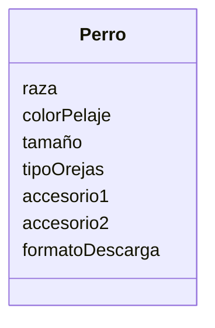

Estas diseñando una app para dibujar de perros con IA 
los usuarios pueden seleccionar características como 
la raza (por ejemplo, labrador o pastor alemán), el color 
del pelaje, el tamaño y el tipo de orejas.
Además, pueden agregar hasta dos accesorios, como sombreros 
o gafas.
El dibujo final puede descargarse en formato PNG o JPG.

# Analisis

Requisitos:
- Dibujar perros con IA
- Seleccionar raza labrador o pastor alemán
- Seleccionar color de pelaje
- Seleccionar tamaño
- Seleccionar tipo de orejas
- Agregar hasta dos accesorios sombreros o gafas
- Descargar en formato PNG o JPG

Objetos:
- Perro

Características:
- Perro
  - raza
  - colorPelaje
  - tamaño
  - tipoOrejas
  - accesorio1
  - accesorio2
  - formatoDescarga

Acciones:
- (No hay acciones)

# Diseño:
Clases:
- Perro :
  - Nombre: Perro
  - Atributos:
    - raza
    - colorPelaje
    - tamaño
    - tipoOrejas
    - accesorio1
    - accesorio2
    - formatoDescarga

# Diagrama de clases:

