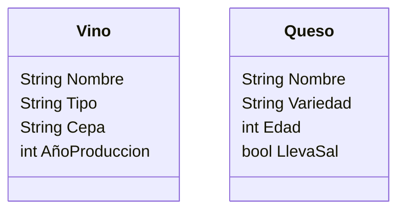

Una vinoteca quiere registrar los vinos y quesos que ofrecen.
De cada vino se necesita registrar su nombre, tipo, cepa y año de producción.
De cada queso se necesita registrar su nombre, variedad, edad y si lleva sal.
La vinoteca tiene en su inventario 4 vinos y 3 quesos 

- Realiza el análisis y diseño de las clases Vino y Queso
- Escribe el codigo en Python para crear la clases Vino y Queso
- Instancia los 4 vinos y 3 quesos con sus respectivos atributos

# Analisis
Requisitos:
- Registrar vinos y quesos
- Registrar los atributos de cada vino y queso

Objetos:
- Vino
- Queso

Características:
- Vino
  - Nombre
  - Tipo
  - Cepa
  - AñoProduccion
- Queso
  - Nombre
  - Variedad
  - Edad
  - LlevaSal

Acciones:
- (No hay acciones)

# Diseño de la clase

