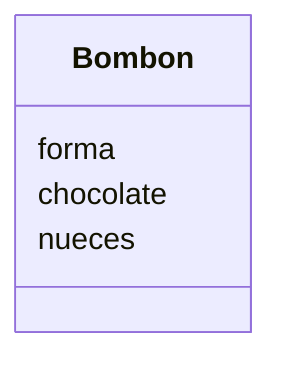

# Diseño:

Clases:
- Bombon 🧆:
    - Nombre: Bombon
    - Atributos:
        - forma
        - chocolate
        - nueces
    - Métodos:
        - (No hay métodos)

# Diagrama de clases:

```mermaid
classDiagram
  class Bombon {
    forma
    chocolate
    nueces
  }
```