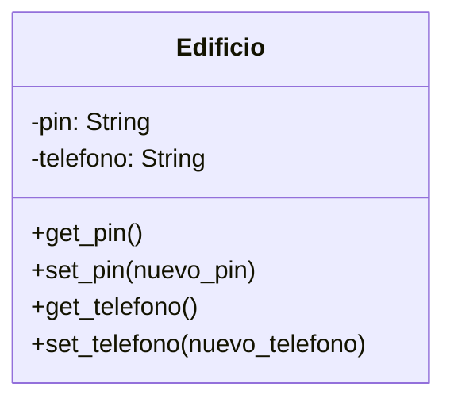

# Edificio

**Descripción:**
Un edificio necesita un sistema de control de acceso,
existe un pin de desbloqueo privado,
cualquier persona puede ver el pin de desbloqueo 
cualquier persona puede cambiar el pin
el pin de desbloqueo debe ser máximo 4 dígitos
el pin inicial será 1234

El edificio tendrá un número telefónico,
cualquiera puede ver el número telefónico
cualquiera puede cambiar el número telefónico
el número telefónico inicial será 123-456-7890

Del edificio vamos a cambiar el getter y setter
del pin por una propiedad para que se pueda acceder
como si fuera un atributo y no como métodos

Del edificio el número telefónico lo vamos a cambiar
por una propiedad para que se pueda acceder
como si fuera un atributo y no como métodos

## Análisis

### Requisitos
- El edificio tiene un pin
- Cualquiera puede ver el pin
- Cualquiera puede cambiar el pin
- El pin debe ser máximo de 4 dígitos
- El pin inicial es 1234

- El edificio tiene un número telefónico
- Cualquiera puede ver el número telefónico
- Cualquiera puede cambiar el número telefónico
- El número telefónico inical es 123-456-7890

### Objetos
- Edificio

### Características
- Edificio:
    - pin: String
    - número_telefónico: String
### Acciones
- Edificio:
    - get_pin()
    - set_pin(nuevo_pin)
    - get_telefono()
    - set_telefono(nuevo_telefono) 

## Diseño

