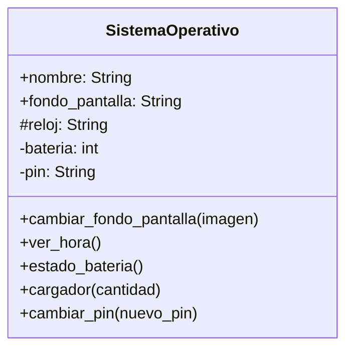

# Creando un sistema operativo para móviles

## Análisis

### Requisitos:
- Tiene un nombre
- Tiene un fondo de pantalla
- Tiene un reloj
- Cualquiera puede cambiar el fondo de pantalla
- Existe un método ver hora
- Tiene una batería
- Existe un método estado_batería
- Existe un método cargador para cargar la batería
- Tiene un pin de desbloqueo
- Solo el sistema puede cambiar el pin de desbloqueo
- No se puede ver el pin de desbloqueo

### Objetos:
- SistemaOperativo

### Características:
- SistemaOperativo:
    - nombre: String
    - fondo_pantalla: String
    - reloj: String
    - bateria: int
    - ping: String

### Acciones:
- SistemaOperativo:
    - cambiar_fondo_pantalla(imagen)
    - ver_hora()
    - estado_bateria()
    - cargador(cantidad)
    - cambiar_pin(nuevo_pin)

